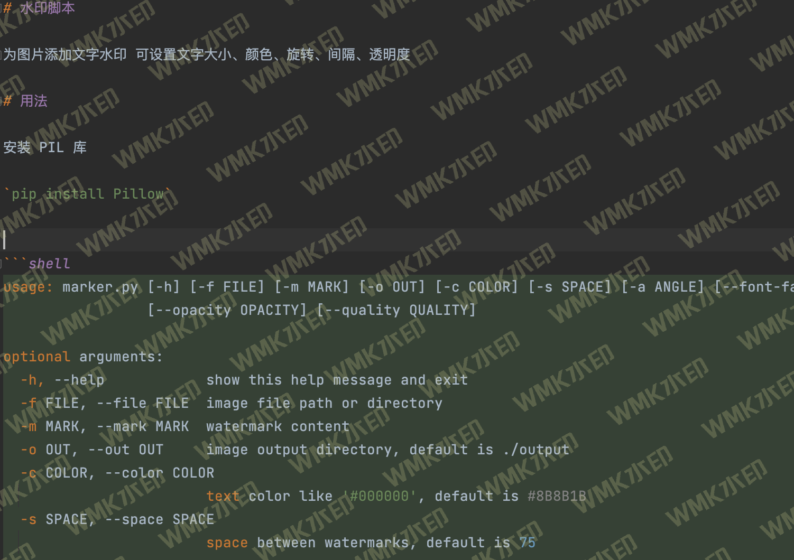

# 水印脚本

<p>
  <a aria-label="GitHub commit activity" href="https://github.com/berbai/WMK/commits/main" title="GitHub commit activity">
    
  </a>
  <a aria-label="GitHub contributors" href="https://github.com/berbai/WMK/graphs/contributors" title="GitHub contributors">
    
  </a>
</p>

中文文档 | [README in English](./README.md)

为图片添加水印，可设置水印大小、颜色、旋转、间隔、透明度

## 用法

安装 PIL 库 

`pip install Pillow`

参数说明：

```shell
usage: marker.py [-h] [-f FILE] [-m MARK] [-o OUT] [-c COLOR] [-s SPACE] [-a ANGLE] [--font-family FONT_FAMILY] [--font-height-crop FONT_HEIGHT_CROP] [--size SIZE]
                 [--opacity OPACITY] [--quality QUALITY]

optional arguments:
  -h, --help            show this help message and exit
  -f FILE, --file FILE  image file path or directory
  -m MARK, --mark MARK  watermark content
  -o OUT, --out OUT     image output directory, default is ./output
  -c COLOR, --color COLOR
                        text color like '#000000', default is #8B8B1B
  -s SPACE, --space SPACE
                        space between watermarks, default is 75
  -a ANGLE, --angle ANGLE
                        rotate angle of watermarks, default is 30
  --font-family FONT_FAMILY
                        font family of text, default is './font/庞门正道标题体免费版.ttf'
                        using font in system just by font file name
                        for example 'PingFang.ttc', which is default installed on macOS
  --font-height-crop FONT_HEIGHT_CROP
                        change watermark font height crop
                        float will be parsed to factor; int will be parsed to value
                        default is '1.2', meaning 1.2 times font size
                        this useful with CJK font, because line height may be higher than size
  --size SIZE           font size of text, default is 50
  --opacity OPACITY     opacity of watermarks, default is 0.15
  --quality QUALITY     quality of output images, default is 90
```

## 示例

```shell
python marker.py -f ./example/test.png -m WMK水印 
```




## License

The GPL-2.0 license.